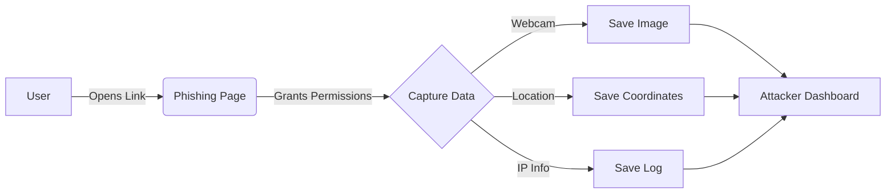

# 🔱 ANUBIS - Camera Phishing Tool v2.1

<div align="center">

```
        ▄▄▄       ███▄    █  █    ██  ▄▄▄▄    ██▓  ██████ 
       ▒████▄     ██ ▀█   █  ██  ▓██▒▓█████▄ ▓██▒▒██    ▒ 
       ▒██  ▀█▄  ▓██  ▀█ ██▒▓██  ▒██░▒██▒ ▄██▒██▒░ ▓██▄   
       ░██▄▄▄▄██ ▓██▒  ▐▌██▒▓▓█  ░██░▒██░█▀  ░██░  ▒   ██▒
        ▓█   ▓██▒▒██░   ▓██░▒▒█████▓ ░▓█  ▀█▓░██░▒██████▒▒
        ▒▒   ▓▒█░░ ▒░   ▒ ▒ ░▒▓▒ ▒ ▒ ░▒▓███▀▒░▓  ▒ ▒▓▒ ▒ ░
         ▒   ▒▒ ░░ ░░   ░ ▒░░░▒░ ░ ░ ▒░▒   ░  ▒ ░░ ░▒  ░ ░
         ░   ▒      ░   ░ ░  ░░░ ░ ░  ░    ░  ▒ ░░  ░  ░  
             ░  ░         ░    ░      ░       ░        ░  
                                           ░               
```

**Advanced Camera & Location Phishing Framework**

[](https://github.com/lahirusanjika/Anubis-Cam)
[](LICENSE)
[](README.md)

</div>

---

### ⚠️ LEGAL DISCLAIMER

> **FOR EDUCATIONAL AND SECURITY RESEARCH PURPOSES ONLY**
>
> This tool is designed for security researchers and authorized testing only.
> **UNAUTHORIZED USE IS ILLEGAL.** By using ANUBIS, you agree to take full responsibility for your actions.

---

## 🎯 Overview

**ANUBIS** is a powerful social engineering framework designed to demonstrate the risks of browser permissions. It generates convincing phishing pages that silently capture:
*   📸 **Webcam Snapshots**
*   📍 **GPS Location** (Latitude/Longitude)
*   🌐 **IP Address & Device Info**

## ✨ Key Features

*   **Multi-Platform**: Works on Linux, macOS, Windows (Git Bash/WSL).
*   **Dual Tunneling**: Built-in support for **CloudFlare** (No Auth) and **Ngrok**.
*   **Silent Capture**: Background image capture while the user interacts with the page.
*   **Real-Time Tracking**: Live logs of IP, Location, and Images as they are captured.
*   **Smart Detection**: Automatically detects OS and installs dependencies.

## 🎭 Phishing Templates

| Template | Description |
| :--- | :--- |
| **1. Live YouTube TV** | Fake live stream interface. |
| **2. Online Meeting** | Zoom-style meeting waiting room. |
| **3. Secure PDF Viewer** | "Protected" document requiring verification. |
| **4. Private Video** | Age-restricted video player. |
| **5. 18+ Image Viewer** | Blurred image requiring age verification. |
| **6. SIM Recharge** | Realistic mobile recharge portal. |

## 🛠️ Installation

### Linux / macOS
```bash
git clone https://github.com/lahirusanjika/Anubis-Cam.git
cd Anubis-Cam
chmod +x anubis.sh
./anubis.sh
```

### Windows
1. Install [Git](https://git-scm.com/download/win) and [PHP](https://windows.php.net/download/).
2. Clone the repo:
   ```powershell
   git clone https://github.com/lahirusanjika/Anubis-Cam.git
   cd Anubis-Cam
   ```
3. Run using one of these methods:
   *   Double-click `START_ANUBIS.bat`
   *   Run `.\run_anubis.ps1` in PowerShell
   *   Run `./anubis.sh` in Git Bash

## 🚀 Usage

1.  **Run the script**:
    ```bash
    ./anubis.sh
    ```
2.  **Select a Tunnel**:
    *   `CloudFlare` (Recommended for quick tests, no account needed).
    *   `Ngrok` (Requires auth token, custom domains).
3.  **Select a Template**: Choose one of the 6 scenarios.
4.  **Send the Link**: Share the generated link with your test device.

## 📂 Output Data

All captured data is saved in the project directory:

*   `images/` - Captured webcam photos (`.png`)
*   `saved_locations/` - GPS coordinates (`.txt`)
*   `ip.txt` - Victim IP addresses

## 🏗️ Architecture



## 🤝 Contributing

Pull requests are welcome. For major changes, please open an issue first to discuss what you would like to change.

## 📜 License

This project is licensed under the **Educational Use License**. See the [LICENSE](LICENSE) file for details.

---
<div align="center">
    <b>Made for Security Research</b>
</div>
